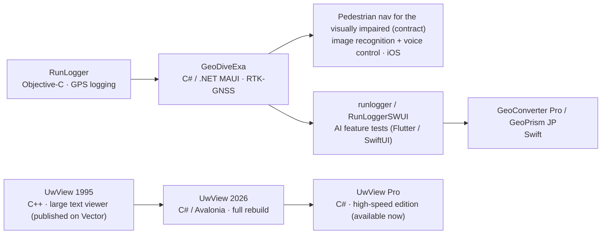

<h1 align="center">y4u</h1>

<em><a href="README.md">日本語</a> ｜ English</em>

  I build non-business software, mainly in the CAD / GIS and engineering domains. 
  Currently focused on geospatial / surveying apps for iOS and cross-platform desktop.

  
  
  
  
  

---

## 📱 Released apps

A family of apps specialized for Japan's geodetic systems, supporting fieldwork and learning in surveying and geodesy.

| App | Description | Links |
| --- | --- | --- |
| **GeoConverter Pro** | Dedicated coordinate-conversion app. World geodetic / Japan plane-rectangular systems, with semi-dynamic and steady-state crustal-movement correction | [App Store](https://apps.apple.com/jp/app/geoconverter-pro/id6761740960) ・ [Web](https://gcpro.y42u.net/) |
| **GeoPrism JP** | Learning app that visualizes datum shifts and the geoid on maps and heatmaps | [App Store](https://apps.apple.com/app/id6780149823) ・ [Web](https://gmp.y42u.net/) |
| **GeoDiveExa** | High-precision RTK-GNSS survey app (the origin of the coordinate-conversion engine) | [Web](https://y42u.net/tec001/) |

> **GeoConverter Pro** and **GeoPrism JP** share **GeoCoreJP** (a Swift Package), the coordinate-conversion engine extracted from GeoDiveExa.

---

## 📚 Kindle books (now on sale)

Two books explaining how Japan's geodetic systems work, now available on Kindle (in Japanese, Kindle Unlimited eligible):

- [*Understanding Japan's Geodetic Systems*](https://www.amazon.co.jp/dp/B0H971W8WX) — why Japan's map coordinates keep shifting, told as one story from TOKYO to JGD2024
- [*Understanding Japan's Geodetic Systems — Implementation*](https://www.amazon.co.jp/dp/B0H97LPNH3) — build a coordinate-conversion engine in Python and match GSI's official results to 1 mm

> 🎁 The main volume is free for a limited time: Jul 20–24, 2026 (PDT).

The test Python scripts used in the "Run it in Python to verify" sections of the Implementation volume are published under [geodetic-book-py](geodetic-book-py/README.md).

---

## 📝 Note (alternate-history fantasy, in Japanese)

*Shin Nirenkanki* — an alternate-history fantasy that ties 400 years of Japan, from the Warring States period to the modern World Cup, together through a "prophecy of the ring." Serialized on note.com (Japanese).

- Magazine (all-in-one bundle) [note.com](https://note.com/amru1957/m/m3e29b983efce)
- 5-minute intro for newcomers [note.com](https://note.com/amru1957/n/nec43a60fb81d)

---

## 🧰 Projects

| Project | Description | License |
| --- | --- | --- |
| [**UwView**](https://github.com/amru195704/UwView) | A memory-thrifty, high-speed viewer for gigantic text files (verified up to ~890 million lines); Avalonia / .NET 10 · Windows / macOS / Linux / WASM. Automatic encoding detection, full-text search, real-time tail. Current theoretical maximum is ~550 billion lines. | [PolyForm Internal Use License 1.0.0](https://polyformproject.org/licenses/internal-use/1.0.0/) |
| [**UwView Pro**](https://uvp.y42u.net/pro/) 🚀 _Available now (macOS first)_ | A commercial, even-faster edition of UwView. A compressed sidecar cache makes **re-open (2nd time on) 0.02–0.07 s (1,500×+ vs klogg)**, full-text search **up to ~9× faster than klogg**, and lets you keep and open files at **~1/9 the size** after deleting the original. | Commercial (one-time $129 / $9 per month) |
| [**runlogger**](https://github.com/amru195704/runlogger) | A Flutter test app partially recreating the old Objective-C iOS app "RunLogger" (for evaluating AI features) | Open source |
| [**RunloggerSWUI**](https://github.com/amru195704/RunloggerSWUI) | The same "RunLogger" partially recreated in SwiftUI (for evaluating AI features) | Open source |

> **About the UwView license** (this summary does not replace the license text):
>
> - Free for personal use and for a company's internal business use.
> - You may **not** distribute the software (redistribution, bundling into a product/service, resale, providing to third parties, hosting, or OEM embedding are not permitted).
> - Those uses require a separate commercial (redistribution/OEM) license from the author.

> **🚀 UwView Pro (available now, macOS first)** → [product page](https://uvp.y42u.net/pro/) (one-time $129 / $9 per month) — measured against the large-log viewer [klogg](https://klogg.filimonov.dev/) (OpenStreetMap Japan, 47.73 GB / 892,239,125 lines, external USB, 32 GB RAM, 10-core Mac; hit counts verified identical to klogg):
>
> - **Re-open (2nd time on): 0.02–0.07 s** (klogg re-indexes every time, ~110 s = **1,500×+**)
> - **Full-text search "Tokyo": 14.3 s** (klogg 120–135 s = **~9×**; ~8.6× case-insensitive, ~4.4× regex)
> - **Archive mode: delete the original and keep 48 GB → 5.3 GB (~1/9)**, opened directly (checksum-protected)

---

## 🧭 How it evolved

My personal iOS / cross-platform apps grew out of **RunLogger**, a GPS-logging app.

Starting from RunLogger (GPS logging), I built **GeoDiveExa** (C#). I then developed, under contract, a **pedestrian navigation app for the visually impaired** (an iOS app that uses *image recognition* as a substitute for sight and *voice* for control). As an **AI feature study** I prototyped runlogger / RunLoggerSWUI, and applied what I learned to build **GeoConverter Pro / GeoPrism JP** in Swift.

**UwView** has a separate origin: a large text viewer I first wrote in **C++** in 1995 (published on Japan's "Vector" archive), fully rebuilt in **C# / Avalonia** in 2026, and now extended into the high-speed **UwView Pro**.

---

## 👤 Background

- **Experience**: 40+ years of software development. I specialize in non-business engineering domains, from CAD / GIS to radio and geodesy.
- **Highlights**:
  - **A CAD system I developed ~40 years ago (early 1980s) on an Apollo workstation is still in use today as a CATV (cable-TV) design CAD** ([the story from back then](https://y42u.net/tec001/2024/06/17/1980/))
  - **Developed a radio-wave propagation simulator during the transition to terrestrial digital broadcasting**
  - Developed a CAD system for creating car-navigation map data
- **Main field**: CAD / GIS and engineering software (non-business)
- **Qualification**: First-Class Radio Engineer (now First-Class Technical Radio Operator for On-The-Ground Services)
- **Now**: developing surveying / geodesy apps for iOS and cross-platform desktop

## 🛠 Tech stack

- **Languages**: C / C++ / Python / C# / Swift
- **iOS**: Swift / SwiftUI / MapKit
- **Cross-platform**: .NET MAUI (field apps) · Avalonia UI (desktop / WASM) · Flutter
- **Domains**: CAD (CATV design / car-navigation map data) · GIS · RTK-GNSS positioning · geodetic-datum conversion (TKY2JGD / semi-dynamic / pos2jgd) · coordinate projection · image recognition · speech recognition

---

🌐 <a href="https://y42u.net/">y42u.net</a>

