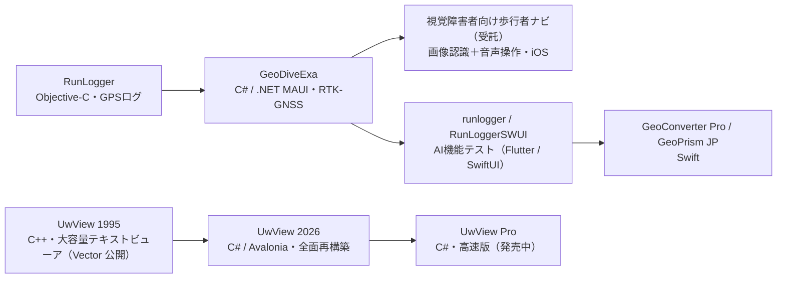

<h1 align="center">y4u</h1>

<em>日本語 ｜ <a href="README.en.md">English</a></em>

  CAD / GIS・エンジニアリング領域を中心に、事務系以外のソフトウェアを開発しています。 
  現在は iOS / クロスプラットフォームの測量・測地アプリに注力中。 
  <em>Software engineer in CAD/GIS and engineering domains — currently building geospatial apps for iOS &amp; desktop.</em>

  
  
  
  
  

---

## 📱 リリース済みアプリ

測量・測地の現場と学習を支える、日本の測地系に特化したアプリ群です。

| アプリ | 内容 | リンク |
| --- | --- | --- |
| **GeoConverter Pro** | 座標変換専用アプリ。世界測地系／平面直角座標系、セミダイナミック補正・定常時地殻変動補正に対応 | [App Store](https://apps.apple.com/jp/app/geoconverter-pro/id6761740960) ・ [Web](https://gcpro.y42u.net/) |
| **GeoPrism JP** | 測地系のズレやジオイドを地図・ヒートマップで可視化する学習アプリ | [App Store](https://apps.apple.com/app/id6780149823) ・ [Web](https://gmp.y42u.net/) |
| **GeoDiveExa** | RTK-GNSS 対応の高精度位置調査アプリ（座標変換エンジンの原点） | [Web](https://y42u.net/tec001/) |

> **GeoConverter Pro** と **GeoPrism JP** は、GeoDiveExa から抽出した座標変換エンジン **GeoCoreJP**（Swift Package）を共有しています。

---

## 📚 Kindle本（発売中）

日本の測地系の仕組みを解説する「日本の測地系」シリーズ2冊を、Kindleで発売中です（Kindle Unlimited 対象）。

| 書籍 | 内容 | リンク |
| --- | --- | --- |
| **『日本の測地系がわかる本』**（本編） | 地図の座標はなぜズレるのか。TOKYOからJGD2024まで、百数十年の「座標の引っ越し」を1本の物語で | [Amazon](https://www.amazon.co.jp/dp/B0H971W8WX) |
| **『日本の測地系がわかる本（実装編）』** | 座標変換エンジンをPythonで作って、国土地理院の計算と1mmで一致させる | [Amazon](https://www.amazon.co.jp/dp/B0H97LPNH3) |

> 🎁 本編は **2026/7/20(月) 16:00 〜 7/25(土) 15:59（日本時間）** の期間限定で無料キャンペーンを実施します。

「実装編」の各章「Pythonで動かして確かめる」節で使うテスト用 Python スクリプトを [geodetic-book-py](geodetic-book-py/README.md) 以下に公開しています。

---

## 📝 Note（歴史改変ファンタジー『シン・二連環記』）

戦国から現代のW杯まで、日本の400年を「円環の預言」で貫く歴史改変ファンタジー。

**▶ まずはここから（無料）**

- 【5分で分かる】超入門 ―はじめての方へ― [note.com](https://note.com/amru1957/n/nec43a60fb81d)
- 何が“シン”なのか ―旧版からの増補まるわかり [note.com](https://note.com/amru1957/n/nd0dbb1f7cb56)
- 2つのAIに読ませたら ―絶賛と、容赦ない酷評― [note.com](https://note.com/amru1957/n/n2217739bd6bb)

**マガジン（まとめてお得）**

- 全部入り（本編＋答え合わせ編＋設定資料集）(5冊) [note.com](https://note.com/amru1957/m/m3e29b983efce)
- 本編『シン・二連環記 ―日出ずる国の円環年代記』（全2冊） [note.com](https://note.com/amru1957/m/m35656cfd33cc)
- 答え合わせ編（種明かし・全2冊） [note.com](https://note.com/amru1957/m/mcf8c0c2df60d)
- 円環年代記 オリジナル版・入門セット(8冊) [note.com](https://note.com/amru1957/m/m460b0543b6ca)

**単品**

- 設定資料集『守り人と十三の椅子』（光と影・保存版） [note.com](https://note.com/amru1957/n/n4a8037aa0754)

---

## 🧰 プロジェクト

| プロジェクト | 内容 | ライセンス |
| --- | --- | --- |
| [**UwView**](https://github.com/amru195704/UwView) | 最大９億行（までしか確認で来ていない）巨大テキストを省メモリ・高速に閲覧するビューア（Avalonia / .NET 10・Windows / macOS / Linux / WASM）。文字コード自動判定・全文検索・リアルタイム Tail 対応 現状の理論上最大行数は5500億行　| [PolyForm Internal Use License 1.0.0](https://polyformproject.org/licenses/internal-use/1.0.0/) |
| [**UwView Pro**](https://uvp.y42u.net/pro/) 🚀 _発売中（macOS版先行）_ | UwView をさらに高速化した商用版。圧縮サイドカーキャッシュで **2回目以降のオープンが 0.02〜0.07 秒（klogg 比 1,500 倍以上）**、全文検索は **klogg 比 最大約 9 倍**、元ファイルを削除して **約 1/9 サイズ**で保管・閲覧も可能 | 商用（[**買い切り $129／月額 $9 を購入（Polar）**](https://buy.polar.sh/polar_cl_37MuoKb8WjSfLZ7hhjaTTzwAVBxu2XyqbnuWe3aGzbj)） |
| [**runlogger**](https://github.com/amru195704/runlogger) | 旧 Objective-C 製 iOS アプリ「RunLogger」の機能を一部再現した Flutter 製テストアプリ（AI 機能の検証目的） | オープンソース |
| [**RunloggerSWUI**](https://github.com/amru195704/RunloggerSWUI) | 同「RunLogger」を SwiftUI で一部再現したテストアプリ（AI 機能の検証目的） | オープンソース |

> **UwView のライセンスについて**（この要約はライセンス本文に代わるものではありません）:
>
> - 個人、および企業の「社内業務利用」は無料です。
> - 本ソフトウェアの頒布はできません（再配布・製品/サービスへの組込み・転売・第三者への提供・ホスティング提供・OEM 組込みは許可されません）。
> - これらを行う場合は、作者から別途の商用（再配布/OEM）ライセンスが必要です。

> **🚀 UwView Pro（発売中・macOS版先行）** → [製品ページ](https://uvp.y42u.net/pro/) ／ [**購入（Polar・買い切り $129／月額 $9）**](https://buy.polar.sh/polar_cl_37MuoKb8WjSfLZ7hhjaTTzwAVBxu2XyqbnuWe3aGzbj) — 大容量ログビューア [klogg](https://klogg.filimonov.dev/) との実測比較（OpenStreetMap 日本全域 47.73GB・892,239,125 行、外付けUSB・RAM32GB・10コア Mac、検索ヒット数は klogg と厳密一致で相互検証済み）:
>
> - **2回目以降のオープン: 0.02〜0.07 秒**（klogg は毎回再索引 約110秒 ＝ **1,500倍以上**）
> - **全文検索 "Tokyo": 14.3 秒**（klogg 120〜135秒 ＝ **約9倍**。大小無視で約8.6倍、正規表現で約4.4倍）
> - **アーカイブ運用: 元ファイルを削除して 48GB→5.3GB（約 1/9）** で保管・そのまま閲覧（チェックサム保護付き）

---

## 🧭 開発の歩み

個人開発 iOS/クロスプラットフォームアプリは、GPS ログアプリ **RunLogger** を源流に進化してきました。

RunLogger（GPS ログ）を土台に **GeoDiveExa**（C#）を開発。その後、受託で**視覚障害者向けの歩行者ナビ**（目の代わりに *画像認識*、操作は *音声* で行う iOS アプリ）を開発しました。さらに **AI 機能の検証**として runlogger / RunLoggerSWUI を試作し、その知見を活かして Swift で **GeoConverter Pro / GeoPrism JP** を作り込みました。

**UwView** は源流が異なります。1995 年に **C++** で作った大容量テキストビューア（Vector で公開）を、2026 年に **C# / Avalonia** で全面再構築し、さらに高速版 **UwView Pro** へと発展させています。

---

## 👤 バックグラウンド

- **経歴**: 40年以上のソフトウェア開発歴。CAD / GIS から電波・測地分野まで、事務系以外のエンジニアリング領域を専門にしています。
- **主な実績**:
  - **約40年前（1980年代前半）に Apollo ワークステーション上で開発した CAD が、現在も CATV（ケーブルテレビ）設計 CAD として使われ続けています**（[開発当時の話](https://y42u.net/tec001/2024/06/17/1980/)）
  - **地上デジタル放送への移行期に電波伝搬シミュレータを開発**
  - カーナビ用地図データ作成 CAD の開発
- **主分野**: CAD / GIS・エンジニアリング系ソフトウェア開発（事務系以外）
- **資格**: 第１級無線技術者（現・第一級陸上無線技術士）
- **現在**: iOS / クロスプラットフォームの測量・測地アプリ開発

## 🛠 技術スタック

- **言語**: C / C++ / Python / C# / Swift
- **iOS**: Swift / SwiftUI / MapKit
- **クロスプラットフォーム**: .NET MAUI（現場アプリ）・Avalonia UI（デスクトップ / WASM）・Flutter
- **ドメイン**: CAD（CATV 設計 / カーナビ用地図データ作成）・GIS・RTK-GNSS 測位・測地系変換（TKY2JGD / セミダイナミック / pos2jgd）・座標系投影・画像認識・音声認識

---

🌐 <a href="https://y42u.net/">y42u.net</a>

