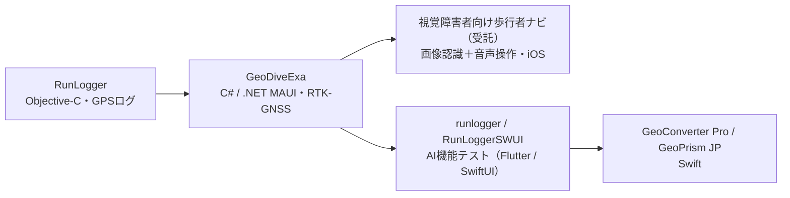

<h1 align="center">y4u</h1>

  CAD / GIS・エンジニアリング領域を中心に、事務系以外のソフトウェアを開発しています。 
  現在は iOS / クロスプラットフォームの測量・測地アプリに注力中。 
  <em>Software engineer in CAD/GIS and engineering domains — currently building geospatial apps for iOS &amp; desktop.</em>

  
  
  
  
  

---

## 📱 リリース済みアプリ

測量・測地の現場と学習を支える、日本の測地系に特化したアプリ群です。

| アプリ | 内容 | リンク |
| --- | --- | --- |
| **GeoConverter Pro** | 座標変換専用アプリ。世界測地系／平面直角座標系、セミダイナミック補正・定常時地殻変動補正に対応 | [App Store](https://apps.apple.com/jp/app/geoconverter-pro/id6761740960) ・ [Web](https://gcpro.y42u.net/) |
| **GeoPrism JP** | 測地系のズレやジオイドを地図・ヒートマップで可視化する学習アプリ | [App Store](https://apps.apple.com/app/id6780149823) ・ [Web](https://gmp.y42u.net/) |
| **GeoDiveExa** | RTK-GNSS 対応の高精度位置調査アプリ（座標変換エンジンの原点） | [Web](https://y42u.net/tec001/) |

> **GeoConverter Pro** と **GeoPrism JP** は、GeoDiveExa から抽出した座標変換エンジン **GeoCore**（Swift Package）を共有しています。

---

## 📚 Kindle本（発売予定）

日本の測地系の仕組みを解説する書籍を2冊、Kindleで発売予定です。

- 『日本の測地系がわかる』
- 『日本の測地系がわかる　実装編』

「実装編」の各章「Pythonで動かして確かめる」節で使うテスト用 Python スクリプトを [geodetic-book-py](geodetic-book-py/README.md) 以下に公開しています。

---

## 📝 Note（販売中）

- 『シン・二連環記　全部入り（本編＋副読本＋資料）』 [note.com](https://note.com/amru1957/m/m3e29b983efce)
- 『シン・二連環記 ―日出ずる国の円環年代記』 [note.com](https://note.com/amru1957/m/m35656cfd33cc)
- 『シン・二連環記 ―答え合わせ編―（種明かし・全2部）』 [note.com](https://note.com/amru1957/m/mcf8c0c2df60d)
- 『円環年代記 オリジナル版・入門セット』 [note.com](https://note.com/amru1957/m/m460b0543b6ca)

---

## 🧰 プロジェクト

| プロジェクト | 内容 | ライセンス |
| --- | --- | --- |
| [**UwView**](https://github.com/amru195704/UwView) | 最大2億行クラスの巨大テキストを省メモリ・高速に閲覧するビューア（Avalonia / .NET 10・Windows / macOS / Linux / WASM）。文字コード自動判定・全文検索・リアルタイム Tail 対応 | [PolyForm Internal Use License 1.0.0](https://polyformproject.org/licenses/internal-use/1.0.0/) |
| [**runlogger**](https://github.com/amru195704/runlogger) | 旧 Objective-C 製 iOS アプリ「RunLogger」の機能を一部再現した Flutter 製テストアプリ（AI 機能の検証目的） | オープンソース |
| [**RunloggerSWUI**](https://github.com/amru195704/RunloggerSWUI) | 同「RunLogger」を SwiftUI で一部再現したテストアプリ（AI 機能の検証目的） | オープンソース |

> **UwView のライセンスについて**（この要約はライセンス本文に代わるものではありません）:
>
> - 個人、および企業の「社内業務利用」は無料です。
> - 本ソフトウェアの頒布はできません（再配布・製品/サービスへの組込み・転売・第三者への提供・ホスティング提供・OEM 組込みは許可されません）。
> - これらを行う場合は、作者から別途の商用（再配布/OEM）ライセンスが必要です。

---

## 🧭 開発の歩み

個人開発 iOS/クロスプラットフォームアプリは、GPS ログアプリ **RunLogger** を源流に進化してきました。

RunLogger（GPS ログ）を土台に **GeoDiveExa**（C#）を開発。その後、受託で**視覚障害者向けの歩行者ナビ**（目の代わりに *画像認識*、操作は *音声* で行う iOS アプリ）を開発しました。さらに **AI 機能の検証**として runlogger / RunLoggerSWUI を試作し、その知見を活かして Swift で **GeoConverter Pro / GeoPrism JP** を作り込みました。

---

## 👤 バックグラウンド

- **経歴**: 40年以上のソフトウェア開発歴。CAD / GIS から電波・測地分野まで、事務系以外のエンジニアリング領域を専門にしています。
- **主な実績**:
  - **約40年前（1980年代前半）に Apollo ワークステーション上で開発した CAD が、現在も CATV（ケーブルテレビ）設計 CAD として使われ続けています**（[開発当時の話](https://y42u.net/tec001/2024/06/17/1980/)）
  - **地上デジタル放送への移行期に電波伝搬シミュレータを開発**
  - カーナビ用地図データ作成 CAD の開発
- **主分野**: CAD / GIS・エンジニアリング系ソフトウェア開発（事務系以外）
- **資格**: 第１級無線技術者（現・第一級陸上無線技術士）
- **現在**: iOS / クロスプラットフォームの測量・測地アプリ開発

## 🛠 技術スタック

- **言語**: C / C++ / Python / C# / Swift
- **iOS**: Swift / SwiftUI / MapKit
- **クロスプラットフォーム**: .NET MAUI（現場アプリ）・Avalonia UI（デスクトップ / WASM）・Flutter
- **ドメイン**: CAD（CATV 設計 / カーナビ用地図データ作成）・GIS・RTK-GNSS 測位・測地系変換（TKY2JGD / セミダイナミック / pos2jgd）・座標系投影・画像認識・音声認識

---

🌐 <a href="https://y42u.net/">y42u.net</a>

